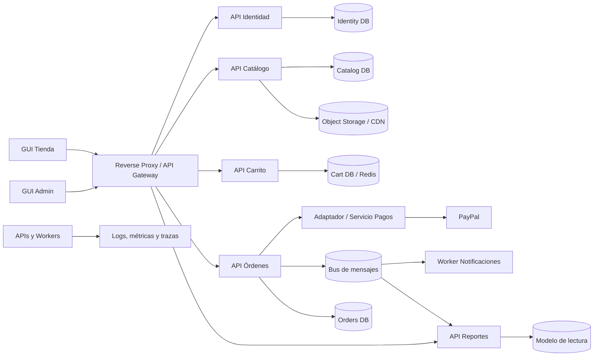

# Plan profesional de evolución arquitectónica de Ecommerce Paduki

## 1. Objetivo

Evolucionar el sistema actual de forma incremental, segura y medible desde una solución ASP.NET MVC 5 sobre .NET
Framework 4.7.2 hacia una plataforma modular basada en APIs, preparada para separar microservicios únicamente cuando
exista una razón operativa o de negocio.

La meta no es crear muchos procesos desde el primer día. La meta es obtener:

- Dominios con responsabilidades y datos claramente definidos.
- Interfaces de usuario desacopladas de SQL Server y de la lógica de negocio.
- APIs versionadas y documentadas.
- Seguridad, pruebas, observabilidad y despliegues repetibles.
- Capacidad para escalar y desplegar módulos críticos de manera independiente.
- Migración sin una reescritura total ni una interrupción prolongada.

## 2. Diagnóstico del sistema actual

La solución ya tiene una separación lógica inicial:

- `CapaPresentacionAdmin`: interfaz MVC para administración.
- `CapaPresentacionTienda`: interfaz MVC para clientes.
- `CapaNegocio`: reglas de negocio e integraciones.
- `CapaDatos`: acceso directo a SQL Server mediante ADO.NET, consultas y procedimientos almacenados.
- `CapaEntidad`: entidades compartidas por todas las capas.

### Riesgos y acoplamientos encontrados

1. Los controladores MVC instancian clases de negocio directamente con `new`, por lo que no hay inversión de
   dependencias ni pruebas aisladas sencillas.
2. Los proyectos de presentación conocen `CapaNegocio` y `CapaEntidad`; no existe una API como frontera estable.
3. La capa de datos comparte una sola cadena de conexión y un solo esquema SQL Server.
4. Parte de la lógica de checkout, cálculo de totales, PayPal, sesión y persistencia está coordinada desde el
   controlador de tienda.
5. Las imágenes se guardan en una ruta local del servidor y se convierten a Base64 durante las consultas.
6. La autenticación depende de Forms Authentication y estado de sesión del servidor.
7. Las credenciales de SMTP y PayPal, la conexión de base de datos y rutas locales están en archivos o código fuente.
8. Algunas excepciones de datos se silencian devolviendo listas vacías, lo cual dificulta detectar fallos.
9. El registro de ventas depende de procedimientos almacenados, tipos de tabla y funciones SQL que no están versionados
   en este repositorio.
10. Hay artefactos compilados y de publicación dentro del árbol de trabajo.

## 3. Decisión arquitectónica recomendada

### Estrategia: monolito modular primero, microservicios después

No conviene separar inmediatamente cada capa técnica como un microservicio. En particular, **la base de datos no debe
convertirse en una API genérica** y la lógica de negocio no debe vivir en un único “servicio de negocio” compartido. Eso
produciría un monolito distribuido: más latencia y complejidad, con el mismo acoplamiento.

La separación debe hacerse por **capacidades de negocio** o bounded contexts:

1. **Identidad y clientes**: registro, acceso, perfiles y roles.
2. **Catálogo**: productos, categorías, marcas, precios, disponibilidad de lectura e imágenes.
3. **Carrito**: carrito activo y sus cantidades.
4. **Órdenes**: checkout, venta, detalle, dirección y estado de orden.
5. **Pagos**: creación, captura y conciliación de pagos con PayPal.
6. **Inventario**: stock, reservas y movimientos. Inicialmente puede vivir dentro de Catálogo.
7. **Notificaciones**: correo transaccional.
8. **Reportes**: consultas administrativas y exportaciones.

Al principio estos módulos pueden ejecutarse dentro de una sola API desplegable, pero sin referencias directas entre sus
capas internas. Se extraerán a procesos independientes cuando lo justifiquen la carga, el riesgo, la frecuencia de
despliegue o la propiedad por equipos.

## 4. Arquitectura objetivo



### Tecnología sugerida

- **Backend nuevo**: ASP.NET Core sobre una versión LTS soportada de .NET al iniciar la implementación; actualmente el
  objetivo razonable es .NET 8 LTS, verificando soporte antes de comenzar.
- **Contrato HTTP**: REST JSON, OpenAPI, rutas `/api/v1/...` y Problem Details RFC 7807.
- **Persistencia**: SQL Server inicialmente; EF Core para evolución normal y Dapper/ADO.NET donde los procedimientos
  almacenados deban conservarse.
- **Identidad**: ASP.NET Core Identity o proveedor OIDC/OAuth 2.0 administrado. Tokens de corta duración y refresh
  tokens seguros.
- **Mensajería**: no agregarla hasta necesitar procesos asíncronos; luego RabbitMQ, Azure Service Bus o equivalente con
  patrón Outbox.
- **Imágenes**: Azure Blob Storage, S3 o equivalente, usando URL y CDN; no almacenar rutas físicas ni devolver Base64 en
  listados.
- **GUI**: conservar MVC durante la migración. Evaluar React, Angular, Vue o Blazor sólo como decisión separada; no es
  requisito para desacoplar el backend.
- **Contenedores**: Docker para los componentes ASP.NET Core. El legado .NET Framework puede permanecer temporalmente en
  IIS/Windows.
- **Gateway inicial**: reverse proxy ligero, por ejemplo YARP, Nginx o gateway del proveedor cloud.
- **Observabilidad**: OpenTelemetry, logs estructurados, métricas, trazas distribuidas y correlation ID.

## 5. Principios y reglas no negociables

1. Cada módulo es dueño de sus reglas y tablas; otro módulo no consulta sus tablas directamente.
2. La GUI sólo se comunica con backend mediante contratos HTTP, nunca con la base de datos.
3. No se comparten entidades de persistencia entre servicios. Se comparten contratos versionados mínimos o eventos
   inmutables.
4. Ningún servicio nuevo depende de `CapaDatos`, `CapaNegocio` o `CapaEntidad`.
5. No se realiza una reescritura “big bang”; se aplica el patrón Strangler Fig.
6. Cada incremento debe poder desplegarse y revertirse independientemente.
7. Las operaciones de pago y creación de órdenes deben ser idempotentes.
8. No se usan transacciones distribuidas. La consistencia entre servicios se resuelve con eventos, Outbox, reintentos y
   compensaciones.
9. Todo secreto sale del repositorio y se obtiene desde variables de entorno o un secret manager.
10. Una API no se considera terminada sin pruebas, observabilidad, documentación y pipeline.

## 6. Estructura recomendada para el código nuevo

Mantener temporalmente el legado y agregar una zona nueva:

```text
/ecommerce
  /legacy
    CapaPresentacionAdmin
    CapaPresentacionTienda
    CapaNegocio
    CapaDatos
    CapaEntidad
  /src
    /BuildingBlocks
    /Modules
      /Identity
        Identity.Api
        Identity.Application
        Identity.Domain
        Identity.Infrastructure
      /Catalog
        Catalog.Api
        Catalog.Application
        Catalog.Domain
        Catalog.Infrastructure
      /Cart
      /Orders
      /Payments
      /Notifications
      /Reporting
    /Gateway
  /tests
    /Unit
    /Integration
    /Contract
    /EndToEnd
  /deploy
    /docker
    /iac
  /docs
    /adr
    /api
    /runbooks
```

Mientras sea un monolito modular, puede existir un solo host `Ecommerce.Api` que cargue los módulos. Los proyectos
`*.Api` independientes se crean sólo al extraer un módulo a otro proceso.

## 7. Plan de trabajo incremental

Cada proyecto pequeño debe terminar con una demostración, criterios de aceptación cumplidos y una decisión explícita de
continuar o ajustar.

### Proyecto 0 — Contención inmediata de seguridad

**Prioridad:** crítica  
**Duración orientativa:** 1–2 días

**Tareas:**

- Revocar y rotar de inmediato las credenciales SMTP y PayPal expuestas.
- Cambiar credenciales de base de datos si alguna estuvo publicada o compartida.
- Eliminar secretos del código y configuración versionada; usar variables de entorno o secret manager.
- Revisar el historial Git con una herramienta de detección de secretos y, si el repositorio salió del equipo, limpiar
  el historial según la política de seguridad.
- Crear archivos de configuración de ejemplo sólo con nombres de variables.
- Agregar reglas para no versionar `bin`, `obj`, paquetes restaurados, archivos de usuario, publicación y configuración
  local.

**Entregable:** inventario de secretos, evidencia de rotación y ejecución local sin secretos en Git.

**Criterio de aceptación:** un escáner de secretos no detecta credenciales activas y el sistema obtiene su configuración
sensible fuera del repositorio.

### Proyecto 1 — Línea base reproducible

**Prioridad:** alta  
**Duración orientativa:** 2–4 días

**Tareas:**

- Documentar requisitos de Windows, IIS Express/IIS, Visual Studio, .NET Framework 4.7.2 y SQL Server.
- Exportar al repositorio, mediante migraciones o un proyecto de base de datos, tablas, funciones, tipos y
  procedimientos almacenados requeridos.
- Crear datos semilla sin información sensible.
- Documentar cómo levantar Admin, Tienda y SQL Server desde cero.
- Crear un pipeline que restaure dependencias y compile la solución.
- Etiquetar una versión conocida como estable.

**Entregable:** entorno reproducible y pipeline de compilación.

**Criterio de aceptación:** una máquina limpia puede compilar y ejecutar el flujo principal siguiendo únicamente la
documentación.

### Proyecto 2 — Caracterización del legado

**Prioridad:** alta  
**Duración orientativa:** 3–5 días

**Tareas:**

- Crear pruebas end-to-end de humo para login, catálogo, carrito, checkout sandbox, alta de producto y reporte.
- Capturar contratos JSON actuales que consume JavaScript.
- Medir tiempos base y tasa de errores de los flujos críticos.
- Crear una matriz endpoint → regla de negocio → tabla/procedimiento → dependencia externa.
- Definir datos de prueba y restablecimiento de la base.

**Entregable:** suite de regresión mínima y mapa de dependencias.

**Criterio de aceptación:** los flujos críticos pueden validarse automáticamente antes y después de cada extracción.

### Proyecto 3 — Observabilidad y manejo de errores en el legado

**Prioridad:** alta  
**Duración orientativa:** 2–4 días

**Tareas:**

- Agregar logging estructurado y un correlation ID por petición.
- Sustituir capturas silenciosas por registro de error y respuestas controladas.
- Separar mensajes técnicos de mensajes mostrados al usuario.
- Incorporar health checks para aplicación, SQL Server y PayPal sandbox donde sea viable.
- Definir alertas mínimas: error rate, latencia, disponibilidad y fallos de pago.

**Entregable:** dashboard básico y guía de diagnóstico.

**Criterio de aceptación:** un fallo de checkout puede rastrearse desde la petición web hasta SQL Server o PayPal sin
inspección manual del servidor.

### Proyecto 4 — Esqueleto de plataforma ASP.NET Core

**Prioridad:** alta  
**Duración orientativa:** 3–5 días

**Tareas:**

- Crear la nueva solución ASP.NET Core con API, OpenAPI, health checks y Problem Details.
- Configurar inyección de dependencias, opciones tipadas, validación y logging.
- Crear pruebas unitarias e integración con una base aislada.
- Crear Dockerfile multi-stage y configuración local con Docker Compose para dependencias nuevas.
- Crear pipeline de build, test, análisis estático, escaneo de dependencias y construcción de imagen.
- Registrar ADR-001: monolito modular y extracción progresiva.

**Entregable:** endpoint `/health` y un endpoint de ejemplo desplegados en un ambiente de desarrollo.

**Criterio de aceptación:** un commit genera una imagen inmutable probada y trazable.

### Proyecto 5 — Primera API vertical: Catálogo de sólo lectura

**Prioridad:** alta  
**Duración orientativa:** 4–7 días

Elegir Catálogo como primer corte porque sus lecturas tienen menor riesgo transaccional.

**Tareas:**

- Implementar `GET /api/v1/categories`, `GET /api/v1/brands`, `GET /api/v1/products` y `GET /api/v1/products/{id}`.
- Definir DTOs independientes de `CapaEntidad`.
- Mover filtros y paginación al servidor; no cargar todos los productos para filtrar en memoria.
- Mantener temporalmente las consultas o procedimientos actuales mediante un adaptador de infraestructura.
- Agregar pruebas de contrato y comparación contra respuestas del legado.
- Hacer que Tienda consuma la API para lectura mediante un feature flag.

**Entregable:** primer “vertical slice” real, de HTTP a SQL Server.

**Criterio de aceptación:** el catálogo de Tienda funciona por API y puede regresar al camino legado desactivando el
flag.

### Proyecto 6 — Servicio de imágenes

**Prioridad:** media  
**Duración orientativa:** 3–5 días

**Tareas:**

- Seleccionar object storage y configurar contenedores/buckets privados o públicos según el caso.
- Migrar imágenes existentes conservando un mapa `ProductId → URL`.
- Implementar carga validando MIME, tamaño, extensión y nombre generado por servidor.
- Añadir antivirus si el modelo de amenazas lo requiere.
- Entregar URLs o URLs firmadas; integrar CDN y caché.
- Eliminar progresivamente rutas físicas y Base64 de respuestas de catálogo.

**Entregable:** gestión de imágenes independiente del disco del servidor web.

**Criterio de aceptación:** reiniciar o reemplazar una instancia web no elimina imágenes y los listados ya no
transportan Base64.

### Proyecto 7 — Catálogo administrativo

**Prioridad:** alta  
**Duración orientativa:** 4–7 días

**Tareas:**

- Implementar comandos de alta, edición y desactivación de producto, categoría y marca.
- Usar validación de entrada y control de concurrencia optimista.
- Separar “desactivar” de “eliminar físicamente”.
- Registrar auditoría: actor, fecha, operación y valores relevantes.
- Migrar `CapaPresentacionAdmin` para consumir estos endpoints.
- Retirar el acceso de Admin a `CN_Producto`, `CN_Categoria` y `CN_Marca` al completar el cambio.

**Entregable:** administración de catálogo completamente vía API.

**Criterio de aceptación:** Admin no referencia las clases de negocio de catálogo y todas las mutaciones quedan
auditadas.

### Proyecto 8 — Identidad y acceso

**Prioridad:** alta  
**Duración orientativa:** 5–10 días

**Tareas:**

- Decidir entre proveedor OIDC administrado y ASP.NET Core Identity.
- Modelar usuarios administrativos, clientes, roles y permisos.
- Migrar contraseñas con estrategia de rehash al iniciar sesión; no forzar texto plano ni algoritmos propios.
- Implementar recuperación, verificación de correo, bloqueo, rate limiting y MFA para administradores.
- Reemplazar Forms Authentication y Session por cookie segura BFF o tokens según la arquitectura de GUI elegida.
- Agregar autorización por políticas, no sólo `[Authorize]` genérico.

**Entregable:** autenticación centralizada para Admin y Tienda.

**Criterio de aceptación:** no se almacenan credenciales o identidad de negocio en Session y los permisos
administrativos tienen pruebas automatizadas.

### Proyecto 9 — Carrito

**Prioridad:** media  
**Duración orientativa:** 4–7 días

**Tareas:**

- Crear endpoints para obtener, agregar, cambiar cantidad y quitar productos.
- Asociar el carrito al `CustomerId` autenticado o a un identificador anónimo seguro.
- Validar producto activo y cantidad positiva.
- Definir expiración y estrategia de persistencia; SQL Server primero, Redis sólo si la carga lo justifica.
- No confiar en precio, nombre o total enviados por la GUI.
- Migrar la pantalla de carrito mediante feature flag.

**Entregable:** módulo Carrito con contrato y propiedad de datos definidos.

**Criterio de aceptación:** alterar precios en el navegador no modifica el total calculado en servidor.

### Proyecto 10 — Órdenes y checkout sin pago real

**Prioridad:** crítica  
**Duración orientativa:** 5–10 días

**Tareas:**

- Modelar `Order`, `OrderItem`, dirección, estado y transiciones permitidas.
- Crear la orden desde el carrito usando precios consultados por backend.
- Guardar snapshot de nombre, precio y datos necesarios; una orden histórica no depende del catálogo actual.
- Implementar clave de idempotencia para evitar órdenes duplicadas.
- Conservar inicialmente el procedimiento transaccional de venta detrás de un repositorio si es correcto.
- Probar concurrencia de stock, reintentos y expiración.

**Entregable:** orden pendiente creada de forma transaccional, sin invocar todavía PayPal.

**Criterio de aceptación:** repetir la misma solicitud con la misma clave no duplica orden ni descuenta stock dos veces.

### Proyecto 11 — Pagos PayPal robustos

**Prioridad:** crítica  
**Duración orientativa:** 5–10 días

**Tareas:**

- Encapsular PayPal detrás de `IPaymentGateway`; el dominio no conoce DTOs de PayPal.
- Crear y capturar pagos desde backend con importes obtenidos de la orden persistida.
- Guardar intentos de pago y estados; no depender de `TempData` para completar una compra.
- Implementar webhook firmado de PayPal como confirmación autoritativa.
- Implementar idempotencia, timeout, reintentos limitados con jitter y circuit breaker.
- Definir reconciliación periódica de pagos en estado incierto.
- Asegurar que URLs de retorno provengan de configuración por ambiente.
- Probar sandbox: aprobado, cancelado, duplicado, timeout y webhook fuera de orden.

**Entregable:** pagos trazables y recuperables ante fallos parciales.

**Criterio de aceptación:** una caída después de capturar PayPal no pierde la venta y el reproceso no cobra dos veces.

### Proyecto 12 — Inventario consistente

**Prioridad:** alta  
**Duración orientativa:** 4–8 días

**Tareas:**

- Decidir si Inventario continúa en Catálogo o amerita módulo propio.
- Modelar movimientos y reservas, no sólo un entero mutable.
- Reservar stock durante checkout con expiración; confirmar al pagar y liberar al cancelar.
- Usar concurrencia optimista o actualización condicional en SQL.
- Publicar eventos `StockReserved`, `StockReleased` y `StockCommitted` sólo si ya existe mensajería.

**Entregable:** flujo de stock explícito y probado bajo concurrencia.

**Criterio de aceptación:** pruebas paralelas demuestran que no se vende más inventario del disponible.

### Proyecto 13 — Notificaciones asíncronas

**Prioridad:** media  
**Duración orientativa:** 3–6 días

**Tareas:**

- Crear un worker que procese eventos de orden pagada, recuperación de cuenta y otros correos.
- Usar proveedor SMTP/API mediante credenciales en secret manager.
- Incorporar Outbox en el productor, consumidor idempotente, reintentos y dead-letter queue.
- Crear plantillas versionadas y sin lógica de negocio.

**Entregable:** envío de correo fuera del camino crítico HTTP.

**Criterio de aceptación:** un proveedor de correo caído no revierte una orden pagada y el mensaje se reintenta sin
duplicados indebidos.

### Proyecto 14 — Reportes y modelo de lectura

**Prioridad:** media  
**Duración orientativa:** 4–8 días

**Tareas:**

- Inventariar cada reporte, filtros, frecuencia y nivel de frescura requerido.
- Exponer reportes paginados y exportaciones como jobs para volúmenes grandes.
- Crear inicialmente vistas de lectura; posteriormente alimentar una base de reporting mediante eventos o ETL.
- Impedir que reportes pesados degraden el checkout.
- Aplicar autorización y protección de datos personales.

**Entregable:** API de reporting aislada del tráfico transaccional.

**Criterio de aceptación:** ejecutar el reporte de mayor volumen no degrada los SLO del catálogo o checkout.

### Proyecto 15 — Gateway y corte definitivo de las GUIs

**Prioridad:** alta  
**Duración orientativa:** 4–7 días

**Tareas:**

- Configurar gateway/reverse proxy, TLS, CORS restrictivo, límites de tamaño y rate limiting.
- Enrutar por prefijo a legado o API nueva.
- Migrar todos los accesos de ambas GUIs a contratos HTTP.
- Aplicar timeouts y propagación de correlation ID.
- Retirar las referencias de presentación a `CapaNegocio`, `CapaDatos` y entidades compartidas.

**Entregable:** Admin y Tienda funcionan como clientes del backend.

**Criterio de aceptación:** las GUIs se compilan sin referencias a capas internas y sólo el backend tiene conectividad
con SQL Server.

### Proyecto 16 — Separación física de datos

**Prioridad:** media; ejecutar sólo después de fronteras estables  
**Duración orientativa:** 5–15 días por dominio

**Tareas:**

- Asignar esquemas separados y usuarios SQL con privilegio mínimo por módulo.
- Eliminar consultas y procedimientos que crucen fronteras.
- Duplicar datos de lectura mediante eventos cuando sea necesario.
- Migrar tablas con estrategia expand/contract y validación de conteos/checksums.
- Separar primero bases lógicas; separar servidores sólo por disponibilidad, cumplimiento, carga o coste.

**Entregable:** propiedad de datos verificable por dominio.

**Criterio de aceptación:** las credenciales de un módulo no pueden leer ni modificar tablas privadas de otro.

### Proyecto 17 — Extraer microservicios selectivamente

**Prioridad:** condicional  
**Duración:** por servicio

Antes de extraer un módulo, debe cumplir al menos una razón comprobable:

- Necesita escalar de manera distinta.
- Requiere despliegues independientes frecuentes.
- Tiene disponibilidad o seguridad diferente.
- Lo mantiene un equipo autónomo.
- Su aislamiento reduce un riesgo operativo real.

Orden de extracción sugerido:

1. Notificaciones, porque ya es asíncrono y tiene bajo acoplamiento.
2. Imágenes/media, si se mantiene código además del object storage.
3. Catálogo, si domina el tráfico de lectura.
4. Identidad, preferentemente mediante proveedor especializado.
5. Pagos, si requiere aislamiento de seguridad/operación.
6. Órdenes e Inventario, sólo cuando los flujos distribuidos estén maduros.

**Criterio de aceptación:** cada servicio tiene repositorio lógico de datos, pipeline, dashboard, runbook, SLO y
responsable; no se despliega coordinadamente con el monolito para cada cambio.

### Proyecto 18 — Retiro del legado

**Prioridad:** final  
**Duración orientativa:** 1–3 días por componente retirado

**Tareas:**

- Verificar telemetría sin tráfico durante un periodo acordado.
- Deshabilitar primero, observar y después eliminar rutas y código.
- Archivar procedimientos, tablas y configuraciones sin consumidores.
- Revocar credenciales y reglas de red del componente retirado.
- Actualizar documentación, diagramas, inventario y runbooks.

**Entregable:** componentes .NET Framework y capas antiguas retirados progresivamente.

**Criterio de aceptación:** no existen llamadas, jobs ni accesos de datos al componente y hay un procedimiento probado
de recuperación o rollback temporal.

## 8. Backlog transversal obligatorio

Estas actividades acompañan todos los proyectos, no se dejan para el final.

### Seguridad

- Modelado de amenazas para identidad, administración, carga de archivos y pagos.
- TLS extremo a extremo, headers de seguridad, CSRF en cookies y CORS mínimo.
- Validación de entrada, consultas parametrizadas y límites de payload.
- SAST, análisis de dependencias, escaneo de secretos e imágenes de contenedor.
- RBAC, privilegio mínimo y auditoría de operaciones administrativas.
- Política de retención y protección de datos personales.

### Calidad

- Pirámide de pruebas: dominio unitario, integración de SQL/integraciones, contratos y pocos E2E críticos.
- Pruebas de contrato consumidor-proveedor antes de despliegues independientes.
- Migraciones de base probadas en copia representativa.
- Quality gates: compilación, pruebas, vulnerabilidades críticas y cobertura de reglas críticas.

### Operación

- Ambientes separados: local, desarrollo, staging y producción.
- Infraestructura como código para recursos compartidos y por servicio.
- Despliegue rolling, blue/green o canary según riesgo.
- Feature flags con propietario y fecha de retiro.
- Backups automáticos y simulacros de restauración.
- Runbooks para caída de SQL, PayPal, correo, cola y object storage.

### Observabilidad y SLO

Definir por flujo, no sólo por servidor:

- Disponibilidad de catálogo y checkout.
- Latencia p50, p95 y p99.
- Tasa de órdenes fallidas y pagos inciertos.
- Profundidad/edad de colas y dead letters.
- Saturación de conexiones SQL y errores externos.
- Trazas con IDs de cliente anonimizados, `OrderId`, `PaymentId` y correlation ID; nunca credenciales o datos sensibles.

## 9. Estrategia de base de datos

### Etapa A — Base compartida controlada

- Conservar SQL Server para reducir riesgo.
- Crear un esquema por módulo.
- Crear un usuario por módulo con permisos sólo en su esquema.
- Versionar todas las migraciones, funciones, tipos y procedimientos.

### Etapa B — Propiedad lógica

- Prohibir joins entre módulos en código nuevo.
- Consumir otros módulos por API o eventos.
- Mantener réplicas/materializaciones sólo para lectura.

### Etapa C — Separación física selectiva

- Migrar un módulo a otra base con doble lectura o doble escritura sólo como transición controlada.
- Preferir Outbox/CDC para sincronizar.
- Validar conteos, checksums y datos de negocio antes del corte.
- Tener rollback documentado y con tiempo máximo definido.

No es necesario usar una tecnología de base distinta por servicio. La independencia se obtiene primero mediante
propiedad y permisos, no mediante diversidad tecnológica.

## 10. Contratos y comunicación

### HTTP síncrono

Usarlo cuando el consumidor necesita respuesta inmediata:

- Consultar catálogo.
- Modificar carrito.
- Crear orden.
- Consultar estado de pago.

Reglas:

- OpenAPI versionado.
- Paginación, filtros y límites explícitos.
- `Idempotency-Key` en comandos críticos.
- Problem Details para errores.
- Timeout obligatorio; reintentar sólo operaciones seguras/idempotentes.
- No exponer entidades SQL ni excepciones internas.

### Eventos asíncronos

Usarlos para hechos ya ocurridos:

- `OrderCreated`
- `PaymentCaptured`
- `OrderPaid`
- `StockReserved`
- `OrderCancelled`

Reglas:

- Eventos inmutables, con ID, versión, timestamp, correlation y causation ID.
- Outbox transaccional.
- Consumidores idempotentes.
- Dead-letter queue y proceso de reproceso.
- Compatibilidad hacia atrás durante la ventana acordada.

## 11. Estrategia de despliegue

### Fase inicial

- MVC legado en IIS/Windows.
- API ASP.NET Core en contenedor o IIS, detrás del reverse proxy.
- SQL Server compartido con usuarios separados.
- Feature flags para dirigir funciones a legado o API nueva.

### Fase intermedia

- API modular, worker de notificaciones, object storage y gateway.
- Pipeline por componente desplegable.
- Staging con PayPal sandbox y pruebas automatizadas post-deploy.

### Fase madura

- Extraer únicamente servicios justificados.
- Orquestador administrado o plataforma de contenedores sólo cuando la cantidad de servicios y necesidades operativas lo
  ameriten. No adoptar Kubernetes como primer proyecto.
- Autoscaling basado en métricas de negocio/carga y presupuestos de coste.

## 12. Definición de terminado para cada proyecto

Un proyecto pequeño está terminado cuando:

- Tiene alcance y propietario definidos.
- El código compila sin advertencias nuevas relevantes.
- Incluye pruebas unitarias, integración o contrato según corresponda.
- Tiene documentación OpenAPI o de eventos actualizada.
- No agrega secretos ni datos sensibles al repositorio o logs.
- Expone health checks y telemetría útil.
- Tiene pipeline y artefacto versionado.
- Se desplegó en staging y pasó smoke tests.
- Tiene estrategia de rollback probada o claramente ejecutable.
- Se actualizaron ADR, diagrama y runbook si cambió la arquitectura.
- Se midió el resultado contra la línea base.

## 13. Métricas para decidir si la migración funciona

Medir al inicio y después de cada bloque:

- Tiempo desde commit hasta producción.
- Frecuencia de despliegue.
- Porcentaje de despliegues fallidos.
- Tiempo medio de recuperación.
- Cobertura de flujos críticos automatizados.
- Errores y latencia de catálogo/checkout.
- Pagos duplicados o inconclusos.
- Incidentes por secretos/configuración.
- Tiempo para incorporar una máquina o desarrollador nuevo.
- Porcentaje de tráfico atendido por APIs nuevas.
- Número de referencias directas del legado eliminadas.

## 14. Secuencia recomendada de ejecución

### Ola 1 — Estabilizar, semanas 1–3

1. Proyecto 0: seguridad.
2. Proyecto 1: entorno reproducible.
3. Proyecto 2: pruebas de caracterización.
4. Proyecto 3: observabilidad.

### Ola 2 — Crear el camino nuevo, semanas 4–7

1. Proyecto 4: plataforma ASP.NET Core.
2. Proyecto 5: catálogo de lectura.
3. Proyecto 6: imágenes.
4. Proyecto 7: catálogo administrativo.

### Ola 3 — Separar acceso y compra, semanas 8–15

1. Proyecto 8: identidad.
2. Proyecto 9: carrito.
3. Proyecto 10: órdenes.
4. Proyecto 11: pagos.
5. Proyecto 12: inventario.

### Ola 4 — Madurez operativa, semanas 16–21

1. Proyecto 13: notificaciones.
2. Proyecto 14: reportes.
3. Proyecto 15: gateway y corte de GUIs.
4. Proyecto 16: propiedad física de datos donde aporte valor.

### Ola 5 — Optimización continua

1. Proyecto 17: extracción selectiva de microservicios.
2. Proyecto 18: retiro del legado.

Las semanas son una referencia para un equipo pequeño y deben recalibrarse después de Proyectos 1 y 2. No ejecutar todas
las líneas en paralelo: limitar el trabajo en curso y terminar un corte vertical antes de abrir otro.

## 15. Primer sprint recomendado

### Objetivo

Cerrar riesgos críticos y demostrar que el sistema puede evolucionar sin romper el flujo actual.

### Backlog

1. Rotar SMTP, PayPal y credenciales de datos; sacar secretos del repositorio.
2. Limpiar reglas de archivos ignorados y artefactos generados.
3. Versionar el esquema SQL completo.
4. Documentar ejecución local de Admin, Tienda y SQL.
5. Crear pipeline de restauración y compilación.
6. Automatizar smoke tests de login, catálogo y carrito.
7. Crear inventario de endpoints, procedimientos y tablas.
8. Registrar decisiones ADR-001 (monolito modular) y ADR-002 (Strangler Fig).

### Resultado esperado

Al terminar el sprint habrá una base segura, reproducible y medible. Sólo entonces debe comenzar la API nueva de
catálogo.

## 16. Decisiones que deben resolverse antes de implementar

1. Proveedor de nube o infraestructura disponible y presupuesto mensual.
2. Restricciones de Windows/IIS y posibilidad de ejecutar contenedores Linux.
3. Tamaño del equipo y responsables por dominio.
4. Volumen actual/pico de catálogo, carrito, órdenes y reportes.
5. RTO, RPO y disponibilidad objetivo.
6. Requisitos legales y tratamiento de datos personales.
7. Fuente oficial y scripts completos de la base de datos.
8. Estrategia de identidad: proveedor administrado o propia.
9. Object storage, mensajería y plataforma de observabilidad preferidos.
10. Necesidad real de una GUI nueva frente a conservar MVC durante la migración.

## 17. Resultado final esperado

El resultado deseado no es “tener muchos microservicios”. Es una plataforma donde cada dominio pueda evolucionar con
contratos claros, datos protegidos, pruebas automáticas y operación observable. Si el monolito modular satisface carga,
despliegue y organización, puede ser el estado final correcto. Los microservicios se extraen únicamente donde generen un
beneficio medible superior a su coste operativo.
