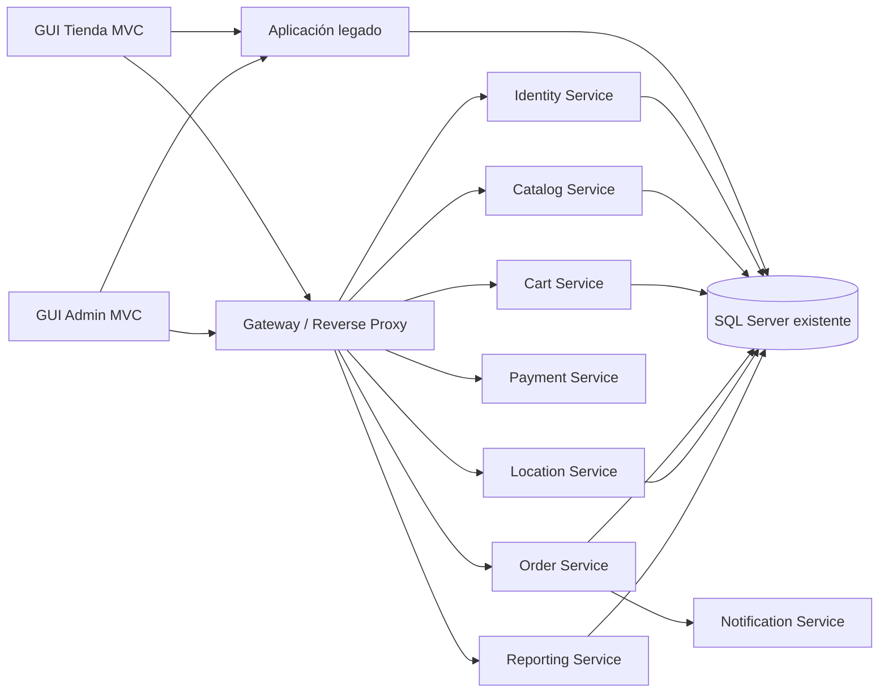

# Registro de cambios de la migración a microservicios

## Propósito

Este documento registra los cambios realizados durante la evolución de Ecommerce Paduki hacia una arquitectura de
microservicios. Complementa el plan de migración y permite reconstruir posteriormente las decisiones, implementaciones,
pruebas, despliegues y pendientes de cada incremento.

## Handoff rápido para la siguiente sesión

> Leer esta sección primero. Resume el estado vigente y reemplaza la necesidad de revisar todo el historial antes de continuar.

### Objetivo activo

Diseñar el primer corte de Cart Service con identidad derivada de JWT, manteniendo recuperación de contraseña pospuesta hasta autorizar su almacenamiento seguro.

### Estado confirmado

- Catalog Service está validado; su integración de GUI está implementada pero pendiente del equipo de interfaz.
- Identity Service ya tiene un primer corte local compilado y probado para autenticar clientes y administradores.
- Identity Service fue conectado correctamente a la base `ecommerce` en SQL Server Docker; `GET /health` respondió `200 OK` y `Healthy`.
- El login real de un administrador activo respondió `200 OK` y emitió un JWT con identidad, rol, emisor, audiencia, expiración y `mustResetPassword`, sin exponer el hash.
- El login real de un cliente respondió `200 OK` y emitió un JWT equivalente con rol `Customer`.
- Una combinación deliberadamente inválida respondió correctamente `401 Unauthorized` con un mensaje genérico.
- El primer corte de autenticación de Identity Service quedó validado contra SQL Server real.
- Las respuestas nunca exponen `Clave` ni hashes.
- Administradores inactivos no pueden autenticarse y ambos perfiles informan `mustResetPassword`.
- Identity Service exige externamente `ConnectionStrings__IdentityDatabase` y `Jwt__SigningKey`; la clave JWT debe tener al menos 32 caracteres.
- Recuperación, cambio de contraseña y registro no fueron migrados porque requieren rediseñar hashes y notificaciones de forma segura.
- La base de datos permanece sin cambios.

### Siguiente incremento exacto

1. Inventariar `CN_Carrito`, `CD_Carrito`, tabla `CARRITO` y contratos JavaScript actuales.
2. Diseñar endpoints para obtener, agregar, cambiar cantidad y quitar productos usando el `CustomerId` del JWT.
3. No aceptar precios, nombres, totales ni identificadores de cliente enviados por la GUI.
4. Mantener SQL Server y el esquema actual sin cambios durante el primer corte si sus restricciones lo permiten.
5. Implementar validación de producto activo y cantidad positiva.
6. Agregar pruebas de autorización, aislamiento entre clientes y manipulación de precios.
7. Integrar Tienda mediante feature flag y conservar rollback a `CN_Carrito`.
8. Extraer el envío de correo a Notification Service y retirar credenciales SMTP del código.

### Restricciones

- No modificar SQL Server, tablas, procedimientos ni datos.
- No migrar todavía altas, ediciones o eliminaciones del administrador.
- No eliminar referencias de `CapaPresentacionTienda` a `CapaNegocio`; siguen siendo necesarias para rollback y funcionalidades no migradas.
- No devolver rutas físicas de imágenes desde la API.
- No guardar cadenas de conexión, contraseñas, Client ID o secretos en archivos versionados.
- Preservar la compatibilidad con .NET Framework 4.7.2 en la GUI.

### Riesgos que deben atenderse

- Las imágenes todavía dependen de `CN_Producto` y del disco legado; este puente debe retirarse al implementar el Proyecto 6.
- `Web.config` todavía contiene credenciales de PayPal versionadas. Deben rotarse y extraerse del repositorio en un incremento de seguridad separado y prioritario.
- Hay una gran cantidad de cambios detectados dentro de `packages/`; no asumir que pertenecen a esta migración ni revertirlos sin autorización.

### Validación mínima

```bash
dotnet test Ecommerce.Services.sln --configuration Release
curl -i http://localhost:5137/health
curl -s http://localhost:5137/api/v1/categories | jq
curl -s http://localhost:5137/api/v1/products | jq
```

Para Swagger en Development:

```text
http://localhost:5137/swagger
```

### Criterio de terminado del siguiente incremento

Con `Features:UseCatalogApi=true`, la tienda debe mostrar categorías, marcas y productos usando Catalog Service sin alterar el contrato de sus vistas. Con el flag en `false`, debe conservarse el camino legado. Ambos modos deben quedar probados y documentados.

## Alcance acordado

- Se crearán servicios separados por funcionalidad de negocio.
- La base de datos SQL Server actual, sus tablas y procedimientos almacenados permanecerán sin modificaciones durante la
  primera etapa.
- Los servicios nuevos podrán consultar la base existente mediante adaptadores propios.
- No se migrarán ni dividirán datos hasta que los contratos y límites funcionales estén estabilizados.
- La aplicación ASP.NET MVC existente continuará funcionando durante la transición.
- La migración será incremental y utilizará feature flags o rutas controladas para permitir rollback.

## Arquitectura de transición



> La base compartida es una decisión transitoria. Cada servicio deberá limitar su acceso a las tablas y procedimientos
> correspondientes a su funcionalidad, aunque inicialmente utilicen la misma instancia.

## Servicios previstos

| Servicio             | Responsabilidad                                         | Componentes actuales relacionados                                     | Estado                     |
|----------------------|---------------------------------------------------------|-----------------------------------------------------------------------|----------------------------|
| Catalog Service      | Productos, categorías, marcas e imágenes                | `CN_Producto`, `CN_Categoria`, `CN_Marca`, clases `CD_*` relacionadas | Validado contra SQL Server |
| Identity Service     | Clientes, usuarios, autenticación, roles y recuperación | `CN_Cliente`, `CN_Usuarios`, controladores de acceso                  | Autenticación validada contra SQL Server |
| Cart Service         | Carrito, productos y cantidades                         | `CN_Carrito`, `CD_Carrito`                                            | Pendiente                  |
| Order Service        | Ventas, detalle, checkout e historial                   | `CN_Venta`, `CD_Venta`                                                | Pendiente                  |
| Payment Service      | Creación, captura y conciliación de PayPal              | `CN_Paypal`                                                           | Pendiente                  |
| Location Service     | Estados, municipios y localidades                       | `CN_Ubicacion`, `CD_Ubicacion`                                        | Pendiente                  |
| Notification Service | Correos transaccionales                                 | Funciones de correo de `CN_Recursos`                                  | Pendiente                  |
| Reporting Service    | Dashboard, reportes y exportaciones                     | `CN_Reporte`, `CD_Reporte`                                            | Pendiente                  |

## Convenciones para registrar cambios

- Registrar una entrada por incremento funcional o despliegue relevante.
- No describir trabajo como terminado hasta que compile y tenga pruebas ejecutadas.
- Incluir rutas, endpoints y nombres de componentes afectados.
- Registrar explícitamente cambios incompatibles, riesgos y procedimiento de rollback.
- No copiar secretos, cadenas de conexión, tokens ni datos personales en este documento.
- Relacionar cada decisión arquitectónica con un ADR cuando afecte a más de un servicio.
- Utilizar fechas ISO 8601 (`AAAA-MM-DD`).

## Estado general

| Área                      | Estado                     | Observación                                                   |
|---------------------------|----------------------------|---------------------------------------------------------------|
| Plan de migración         | Completado                 | Estrategia incremental definida                               |
| Límites funcionales       | Definidos inicialmente     | Deben validarse durante cada extracción                       |
| Base de datos             | Sin cambios                | Se conserva la instancia y el esquema actuales                |
| Plataforma ASP.NET Core   | Implementada               | Solución nueva fijada en .NET 8                               |
| Catalog Service           | Validado contra SQL Server | API de lectura operativa con la base `ecommerce` en Docker    |
| Integración con GUI       | En progreso                | Feature flag implementado; pendiente prueba en Windows/IIS Express   |
| CI/CD de servicios nuevos | No iniciado                | Compilación y pruebas locales disponibles                     |
| Observabilidad            | Parcial                    | Problem Details y health check de SQL incorporados            |

## Registro cronológico

### 2026-09-07 — Validación JWT incorporada en Catalog Service

**Tipo:** seguridad e infraestructura  
**Servicio:** Catalog Service / Identity Service  
**Estado:** completado localmente

#### Cambios realizados

- Catalog Service ahora valida firma, emisor, audiencia y vigencia de JWT con un margen de reloj de un minuto.
- La clave de firma se exige mediante `Jwt__SigningKey` y no se agregó ningún secreto al repositorio.
- Se agregó la política `AdministratorOnly` para proteger futuros endpoints administrativos.
- Las rutas de lectura actuales permanecen públicas y compatibles con Tienda.
- OpenAPI declara el esquema bearer para operaciones protegidas futuras.
- La recuperación de contraseña se pospuso explícitamente y no produjo cambios de esquema.

#### Pruebas ejecutadas

- `dotnet test Ecommerce.Services.sln --configuration Release --no-restore`.
- Resultado total: 24 pruebas aprobadas.
- Catalog Integration aporta seis escenarios: lecturas públicas, producto inexistente, ausencia de token, rol Customer rechazado y rol Administrator aceptado.
- `git diff --check` terminó sin errores; sólo informó advertencias de finales de línea en archivos preexistentes.

#### Compatibilidad

- `GET /api/v1/categories`, marcas, productos, detalle y `/health` no requieren token.
- La integración MVC existente no cambia su contrato ni configuración por este incremento.

#### Próximos pasos

- Iniciar Cart Service con identidad de cliente derivada exclusivamente del JWT.

### 2026-09-07 — Rehash progresivo y cambio autenticado de contraseña

**Tipo:** funcionalidad y seguridad  
**Servicio:** Identity Service  
**Estado:** implementado localmente, pendiente de validación controlada con una cuenta real

#### Cambios realizados

- Se mantuvo verificación SHA-256 en tiempo constante exclusivamente para compatibilidad con hashes existentes.
- Se incorporó generación y verificación de hashes PBKDF2 mediante el formato versionado de ASP.NET Core Identity.
- Después de un login heredado correcto, el servicio intenta reemplazar el hash mediante una actualización optimista que compara el valor anterior.
- Se agregó `POST /api/v1/auth/change-password`, protegido con JWT y una política mínima de longitud y complejidad.
- La identidad y el tipo de cuenta se obtienen del JWT validado; el contrato no acepta IDs arbitrarios.
- El cambio escribe el hash nuevo y limpia `Restablecer` sólo si el hash actual no cambió concurrentemente.
- Se habilitó validación JWT de emisor, audiencia, vigencia y firma con un margen de reloj de un minuto.

#### Base de datos

- La consulta de metadatos confirmó `CLIENTE.Clave varchar(150)` y `USUARIO.Clave varchar(150)`.
- No hubo cambios de esquema ni datos durante la implementación y pruebas automatizadas.
- La activación sobre una cuenta real producirá una actualización de datos explícita y debe ejecutarse de forma controlada.

#### Contratos agregados

- `POST /api/v1/auth/change-password`: requiere bearer token; recibe sólo contraseña actual y nueva; responde `204`, `400`, `401` o `409`.

#### Pruebas ejecutadas

- `dotnet test Ecommerce.Services.sln --configuration Release --no-restore`.
- Resultado total: 18 pruebas aprobadas; 12 unitarias de Identity, 4 HTTP de Identity y 2 unitarias más 2 HTTP de Catalog.
- Se cubrieron hashes heredados, hashes adaptativos, hashes malformados, política de contraseña, cambio válido, acceso anónimo rechazado y cambio autenticado con JWT válido.
- `git diff --check` sobre Identity y sus pruebas terminó sin errores.

#### Rollback

- Antes de validar con datos reales, conservar temporalmente el hash anterior de la cuenta de prueba en un canal seguro.
- Si el login adaptativo falla, restaurar exclusivamente ese valor y detener Identity Service; todavía no existen consumidores de producción.

#### Riesgos y deuda técnica

- Falta validar el rehash sobre una cuenta autorizada de la base real.
- Los JWT emitidos antes de cambiar una contraseña siguen vigentes hasta su expiración máxima de 30 minutos.
- Recuperación de contraseña y Notification Service permanecen pendientes.

#### Próximos pasos

- Ejecutar la validación controlada y después implementar recuperación con token opaco de un solo uso.

### 2026-09-07 — Validación controlada de rehash progresivo

**Tipo:** funcionalidad y seguridad  
**Servicio:** Identity Service  
**Estado:** validado contra SQL Server

#### Cambios realizados

- Se validó el rehash progresivo sobre una cuenta real autorizada.

#### Base de datos

- La consulta de metadatos confirmó `CLIENTE.Clave varchar(150)` y `USUARIO.Clave varchar(150)`.
- La validación controlada actualizó únicamente el hash de una cuenta cliente autorizada, sin cambios de esquema.

#### Pruebas ejecutadas

- Un login real autorizado migró correctamente un hash SHA-256 de 64 caracteres al formato PBKDF2 de 84 caracteres.
- El segundo login con la misma contraseña respondió `200 OK` usando ya el hash adaptativo.
- Una contraseña deliberadamente inválida respondió `401 Unauthorized` después de la migración.
- No se registraron correo, contraseña, token ni contenido del hash en archivos o documentación.

#### Rollback

- El rehash progresivo quedó validado contra SQL Server; no se necesita rollback.
- Identity Service aún no tiene consumidores, por lo que puede detenerse sin afectar las aplicaciones heredadas.

#### Próximos pasos

- Diseñar e implementar recuperación con token opaco de un solo uso.

### 2026-09-07 — Primer corte local de Identity Service

**Tipo:** funcionalidad, infraestructura y seguridad  
**Servicio:** Identity Service  
**Estado:** Autenticación validada contra SQL Server

#### Cambios realizados

- Se crearon `Identity.Api`, `Identity.Application`, `Identity.Domain` e `Identity.Infrastructure` sobre .NET 8.
- Se agregó autenticación para perfiles `Customer` y `Administrator` mediante `POST /api/v1/auth/login`.
- El repositorio consulta por correo únicamente la tabla correspondiente y no carga todas las cuentas.
- Se conservó verificación SHA-256 sólo para compatibilidad, usando comparación en tiempo constante.
- Se agregó emisión de JWT firmado, health check SQL, Problem Details y Dockerfile.
- No se copiaron al servicio los flujos inseguros de correo, contraseñas temporales o credenciales SMTP del legado.

#### Base de datos

- Sin cambios de esquema, tablas, procedimientos ni datos.
- Lectura limitada a `CLIENTE` y `USUARIO`.

#### Pruebas ejecutadas

- `dotnet test Ecommerce.Services.sln --configuration Release --no-restore`.
- Resultado total: 11 pruebas aprobadas; Identity Service aporta cinco unitarias y dos HTTP.
- Se cubrieron credenciales válidas, contraseña inválida, cuenta inactiva, hashes malformados, contrato JWT simulado y ausencia de hashes en respuestas.
- `GET /health` respondió `200 OK` y `Healthy` usando la base real `ecommerce` en SQL Server Docker.
- Un administrador real y activo se autenticó correctamente con `accountType: "Administrator"`; la respuesta incluyó JWT, expiración y `mustResetPassword: false`.
- Un cliente real se autenticó correctamente con `accountType: "Customer"`; la respuesta incluyó JWT, expiración y `mustResetPassword: false`.
- Una prueba negativa respondió `401 Unauthorized` sin revelar si el correo o la contraseña eran incorrectos.
- Se confirmó que una cuenta de cliente existe exclusivamente en `CLIENTE`; su login válido sigue pendiente.
- No se registraron credenciales ni tokens en este documento.

#### Riesgos y deuda técnica

- SHA-256 sin salt no es adecuado para contraseñas; sólo se mantiene para verificar datos existentes.
- Falta validar contra cuentas reales sin copiar correos, contraseñas ni tokens a logs o documentación.
- Registro, cambio y recuperación requieren un diseño seguro posterior.
- Las credenciales SMTP y PayPal existentes en el legado deben rotarse y extraerse del repositorio.

#### Rollback

- Identity Service aún no tiene consumidores, por lo que puede detenerse sin afectar las aplicaciones heredadas.

#### Próximos pasos

- Rotar la clave de firma utilizada durante la prueba.
- Diseñar rehash progresivo y contratos seguros de cambio/recuperación.

### 2026-09-07 — Integración controlada de Tienda con Catalog Service

**Tipo:** funcionalidad y refactorización  
**Servicio:** Catalog Service / CapaPresentacionTienda  
**Estado:** en progreso

#### Cambios realizados

- Se convirtieron a asíncronas las cuatro acciones de lectura de catálogo definidas para el incremento.
- Se agregó `Features:UseCatalogApi` desactivado por defecto y la URL local mediante transformación Debug.
- Con el flag activo, categorías, marcas y datos de producto se obtienen mediante `CatalogApiClient`; con el flag desactivado se conserva el camino de `CapaNegocio`.
- Se mantuvo el contrato JSON heredado y se implementó un puente temporal que obtiene únicamente los archivos de imagen mediante `CN_Producto`.
- `CatalogApiClient` ahora produce un error de configuración explícito si la URL base falta o no es HTTP/HTTPS absoluta.
- No se implementó fallback automático ante indisponibilidad de la API.

#### Base de datos

- Sin cambios de esquema, tablas, procedimientos ni datos.

#### Pruebas ejecutadas

- `dotnet test Ecommerce.Services.sln --configuration Release`: 4 pruebas aprobadas.
- `xmllint --noout CapaPresentacionTienda/Web.config CapaPresentacionTienda/Web.Debug.config`: configuración XML válida.
- La compilación de `CapaPresentacionTienda` no pudo ejecutarse en macOS porque no están disponibles los targets `Microsoft.WebApplication.targets`; queda pendiente compilar y validar en Windows con Visual Studio/IIS Express.

#### Rollback

- Establecer `Features:UseCatalogApi=false` conserva las llamadas heredadas para las cuatro acciones migradas.

#### Riesgos y deuda técnica

- La lectura de imágenes aún depende de `CN_Producto` y del almacenamiento físico legado.
- Falta evidencia funcional de ambos valores del flag y de indisponibilidad de Catalog Service.

#### Próximos pasos

- Ejecutar la matriz de validación en Windows/IIS Express y cerrar el incremento sólo después de documentar resultados reales.

### 2026-09-07 — Validación de Catalog Service contra SQL Server en Docker

**Tipo:** prueba de integración  
**Servicio:** Catalog Service  
**Estado:** completado

#### Ambiente validado

- SQL Server 2022 ejecutándose en Docker.
- Base de datos existente: `ecommerce`.
- Catalog Service ejecutándose mediante Kestrel en `http://localhost:5137`.
- La base de datos no fue modificada.

#### Evidencia

- `GET /health` respondió `200 OK` y `Healthy`.
- `GET /api/v1/categories` respondió `200 OK` con cinco categorías reales.
- `GET /api/v1/products` respondió `200 OK` con cuatro productos reales y sus relaciones de marca y categoría.
- `GET /api/v1/products/8` respondió `200 OK` con el producto solicitado.
- `GET /api/v1/products/1` respondió correctamente `404 Not Found` con Problem Details porque ese identificador no
  existe.

#### Resultado

La API, el adaptador de infraestructura, la conexión configurable y las consultas sobre `CATEGORIA`, `MARCA` y
`PRODUCTO` funcionan correctamente contra la base real en Docker. El criterio de aceptación técnico del primer corte de
lectura quedó cumplido.

#### Hallazgo

Las respuestas de productos aún exponen `imagePath`, que contiene rutas físicas heredadas de Windows. Antes de integrar
la GUI debe sustituirse por un contrato público que entregue una URL de imagen o que omita la ruta interna.

#### Próximos pasos

- Eliminar `imagePath` del contrato HTTP público.
- Incorporar OpenAPI.
- Integrar primero las lecturas de catálogo de Tienda mediante una URL configurable y feature flag.

### 2026-09-07 — Implementación inicial de Catalog Service

**Tipo:** funcionalidad e infraestructura  
**Servicio:** Catalog Service  
**Estado:** completado localmente, pendiente de validación contra SQL Server

#### Objetivo

Crear el primer microservicio de lectura sin modificar la base de datos ni las aplicaciones MVC existentes.

#### Cambios realizados

- Se creó `Ecommerce.Services.sln` fijada en .NET 8 mediante `global.json`.
- Se separaron los proyectos `Catalog.Api`, `Catalog.Application`, `Catalog.Domain` y `Catalog.Infrastructure`.
- Se agregaron modelos propios para producto, categoría y marca sin depender de `CapaEntidad`.
- Se implementó acceso asíncrono y parametrizado al esquema SQL Server existente mediante `Microsoft.Data.SqlClient`.
- Se agregaron filtros opcionales por estado, categoría y marca.
- Se incorporaron Problem Details, manejo global de excepciones y health check de base de datos.
- Se agregó un Dockerfile y reglas para excluir artefactos locales.

#### Contratos agregados

- `GET /api/v1/categories?isActive={bool}`
- `GET /api/v1/brands?categoryId={id}&isActive={bool}`
- `GET /api/v1/products?categoryId={id}&brandId={id}&isActive={bool}`
- `GET /api/v1/products/{id}`
- `GET /health`

#### Base de datos

- No se modificaron tablas, funciones ni procedimientos almacenados.
- El servicio realiza consultas de sólo lectura sobre `CATEGORIA`, `MARCA` y `PRODUCTO`.
- La conexión se configura mediante `ConnectionStrings__CatalogDatabase`; no se agregó ningún valor sensible al
  repositorio.

#### Pruebas ejecutadas

- Comando: `dotnet test Ecommerce.Services.sln --configuration Release`.
- Resultado: 4 pruebas relevantes aprobadas después de retirar las pruebas vacías de plantilla.
- Cobertura: delegación y filtros de aplicación, respuesta de categorías y producto inexistente vía HTTP.
- La conectividad con la instancia SQL Server real queda pendiente porque no hay una conexión local válida configurada
  en este ambiente.

#### Compatibilidad

- No se modificaron `CapaPresentacionTienda`, `CapaPresentacionAdmin` ni la solución heredada.
- No se modificaron los contratos JSON del legado.
- El servicio puede ejecutarse en paralelo con las aplicaciones actuales.

#### Ejecución local

Definir la cadena fuera del repositorio y ejecutar la API:

```bash
export ConnectionStrings__CatalogDatabase="<cadena-de-conexion>"
dotnet run --project src/Services/Catalog/Catalog.Api/Catalog.Api.csproj
```

#### Rollback

La implementación todavía no recibe tráfico. El rollback consiste en detener Catalog Service; las aplicaciones MVC
continúan usando las capas existentes.

#### Próximos pasos

- Validar las consultas contra una instancia de desarrollo de SQL Server.
- Incorporar OpenAPI.
- Integrar primero las lecturas de catálogo de Tienda mediante una URL configurable y feature flag.

### 2026-09-07 — Inicio de la migración

**Tipo:** decisión arquitectónica  
**Estado:** acordado

#### Resumen

Se acordó comenzar la incorporación de microservicios por funcionalidad de negocio, manteniendo sin modificaciones la
base de datos actual durante la primera etapa.

#### Decisiones

- Utilizar ASP.NET Core para los servicios nuevos.
- Mantener las aplicaciones MVC sobre .NET Framework mientras se migran las funcionalidades.
- Crear servicios desplegables de forma independiente.
- Compartir temporalmente SQL Server sin convertir la base de datos en una API genérica.
- Evitar que los servicios nuevos dependan directamente de `CapaNegocio` o `CapaEntidad`.
- Comenzar con Catalog Service por ser un dominio principalmente de lectura y de menor riesgo transaccional.

#### Cambios realizados

- Se creó este registro de cambios.
- No se modificó código funcional.
- No se modificó la base de datos.
- No se modificaron contratos existentes de las GUIs.

#### Contratos agregados

- `GET /api/v1/categories?isActive={bool}`
- `GET /api/v1/brands?categoryId={id}&isActive={bool}`
- `GET /api/v1/products?categoryId={id}&brandId={id}&isActive={bool}`
- `GET /api/v1/products/{id}`
- `GET /health`

#### Base de datos

- No se modificaron tablas, funciones ni procedimientos almacenados.
- El servicio realiza consultas de sólo lectura sobre `CATEGORIA`, `MARCA` y `PRODUCTO`.
- La conexión se configura mediante `ConnectionStrings__CatalogDatabase`; no se agregó ningún valor sensible al
  repositorio.

#### Pruebas ejecutadas

- Comando: `dotnet test Ecommerce.Services.sln --configuration Release`.
- Resultado: 4 pruebas relevantes aprobadas después de retirar las pruebas vacías de plantilla.
- Cobertura: delegación y filtros de aplicación, respuesta de categorías y producto inexistente vía HTTP.
- La conectividad con la instancia SQL Server real queda pendiente porque no hay una conexión local válida configurada
  en este ambiente.

#### Compatibilidad

- No se modificaron `CapaPresentacionTienda`, `CapaPresentacionAdmin` ni la solución heredada.
- No se modificaron los contratos JSON del legado.
- El servicio puede ejecutarse en paralelo con las aplicaciones actuales.

#### Ejecución local

Definir la cadena fuera del repositorio y ejecutar la API:

```bash
export ConnectionStrings__CatalogDatabase="<cadena-de-conexion>"
dotnet run --project src/Services/Catalog/Catalog.Api/Catalog.Api.csproj
```

#### Rollback

La implementación todavía no recibe tráfico. El rollback consiste en detener Catalog Service; las aplicaciones MVC
continúan usando las capas existentes.

#### Próximos pasos

- Validar las consultas contra una instancia de desarrollo de SQL Server.
- Incorporar OpenAPI.
- Integrar primero las lecturas de catálogo de Tienda mediante una URL configurable y feature flag.

## Plantilla para próximas entradas

Copiar esta sección al inicio del registro cronológico y reemplazar todos los campos pendientes.

```markdown
### AAAA-MM-DD — Título breve del cambio

**Tipo:** funcionalidad | infraestructura | seguridad | corrección | refactorización | decisión  
**Servicio:** nombre del servicio  
**Estado:** planificado | en progreso | completado | revertido  
**Responsable:** pendiente  
**Referencia:** issue, pull request o ADR

#### Objetivo

Describir qué problema resuelve este incremento.

#### Cambios realizados

- Cambio concreto 1.
- Cambio concreto 2.

#### Componentes afectados

- Proyecto, API o aplicación afectada.

#### Contratos agregados o modificados

- Método y endpoint.
- Evento y versión.
- Indicar explícitamente si no hubo cambios de contrato.

#### Base de datos

- Sin cambios, o describir el cambio aprobado.
- Tablas o procedimientos consultados por el servicio.

#### Configuración e infraestructura

- Variables de entorno nuevas, sin incluir sus valores.
- Recursos, imágenes o pipelines agregados.

#### Seguridad

- Autenticación y permisos aplicados.
- Resultado del análisis de secretos y dependencias.

#### Pruebas ejecutadas

- Comando o pipeline.
- Resultado.
- Escenarios cubiertos.

#### Evidencia y observabilidad

- Health checks.
- Logs, métricas y trazas agregados.
- Dashboard o alerta relacionada.

#### Despliegue

- Ambiente y versión desplegada.
- Estrategia de liberación.

#### Compatibilidad

- Impacto sobre GUI, legado y consumidores.
- Cambios incompatibles, si existen.

#### Rollback

- Pasos para regresar a la versión anterior.
- Feature flag o ruta alternativa.

#### Riesgos y deuda técnica

- Riesgo o pendiente conocido.

#### Resultado

- Comparación contra el criterio de aceptación.

#### Próximos pasos

- Siguiente tarea concreta.
```

## Historial de versiones del documento

| Versión | Fecha      | Descripción                                                       |
|---------|------------|-------------------------------------------------------------------|
| 1.9     | 2026-09-07 | Validación JWT en Catalog y recuperación pospuesta                 |
| 1.8     | 2026-09-07 | Rehash progresivo validado con una cuenta real autorizada          |
| 1.7     | 2026-09-07 | Rehash progresivo y cambio autenticado implementados localmente    |
| 1.6     | 2026-09-07 | Identity Service validado con clientes y administradores reales   |
| 1.5     | 2026-09-07 | Primer corte local de Identity Service con JWT                    |
| 1.4     | 2026-09-07 | Integración de Tienda implementada, pendiente de validación Windows |
| 1.3     | 2026-09-07 | Validación exitosa de Catalog Service contra SQL Server en Docker |
| 1.2     | 2026-09-07 | Implementación inicial y pruebas del Catalog Service              |
| 1.1     | 2026-09-07 | Creación del registro y documentación del alcance inicial         |
| 1.0     | 2026-09-07 | Creación del registro y documentación del alcance inicial         |
